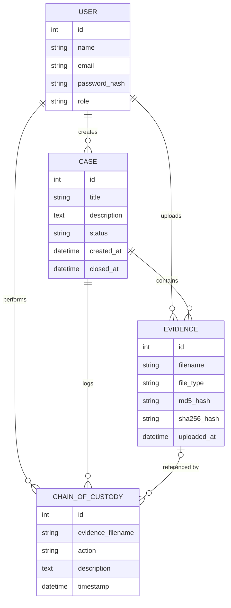

<a name="top"></a>

<div align="center">

<h1>🕵️ Cyber Crime Lab</h1>

<h3>Digital Evidence Management &amp; Forensic Hash Verification</h3>

<p><i>📁 Create cases &nbsp;•&nbsp; 🔐 Hash evidence &nbsp;•&nbsp; 🔗 Track custody &nbsp;•&nbsp; 📄 Generate reports</i></p>

<br/>


<br/>

**[✨ Features](#features)** &nbsp;|&nbsp;
**[🔍 Workflow](#workflow)** &nbsp;|&nbsp;
**[🔗 Chain of Custody](#custody)** &nbsp;|&nbsp;
**[🚀 Getting Started](#getting-started)** &nbsp;|&nbsp;
**[⚙️ Configuration](#configuration)** &nbsp;|&nbsp;
**[⚠️ Academic Note](#academic-note)**

<br/>

| 🔑 **MD5 + SHA-256** | 🔗 **Chain of Custody** | 📄 **PDF Reports** | 📦 **50 MB Uploads** | 🗂️ **20 File Types** |
|:---:|:---:|:---:|:---:|:---:|
| Per evidence file | Upload, download, delete | One click per case | Per file limit | Auto-classified |

</div>

<br/>

<h2 align="center">📖 About</h2>

**Cyber Crime Lab** is a Flask-based academic digital forensics laboratory for managing cybercrime investigation cases and digital evidence.

It gives investigators a simple web environment to **create cases**, **upload evidence**, **calculate cryptographic hashes**, **keep a chain of custody**, and **generate forensic PDF reports**, all wrapped in a playful cartoon-style interface.

> [!NOTE]
> This is an educational prototype built for learning. See the [Academic Note](#academic-note) before using it for anything real.

<div align="right"><a href="#top">⬆ back to top</a></div>

---

<a name="features"></a>
<h2 align="center">✨ Features</h2>

<table>
<tr>
<td width="33%" valign="top">

### 👤 Accounts
- 📝 Investigator registration
- 🔑 Login and logout
- 🔐 Passwords hashed with Werkzeug
- 🛡️ Secure filenames and basic validation

</td>
<td width="33%" valign="top">

### 📁 Cases
- ➕ Create investigation cases
- 📝 Add case descriptions
- 🔄 Status: **Open**, **Under Review**, **Closed**
- 🗑️ Permanently delete a case

</td>
<td width="33%" valign="top">

### 🗃️ Evidence
- 📤 Upload digital evidence
- 📂 File type classification
- 🔑 MD5 and 🔐 SHA-256 hashes
- 📋 Evidence register
- ⬇️ Download and 🗑️ delete

</td>
</tr>
<tr>
<td width="33%" valign="top">

### 🔗 Chain of Custody
- 📤 Upload, 📥 download and 🗑️ delete are logged
- 🧾 Filenames preserved even after deletion
- 🕒 Date, investigator, action, evidence, description

</td>
<td width="33%" valign="top">

### 📄 Reports
- 📑 PDF forensic case report
- 🔑 Includes MD5 and SHA-256 hashes
- 🔗 Includes the Chain of Custody

</td>
<td width="33%" valign="top">

### 🎨 Interface
- 🕵️ Cartoon detective theme
- 📊 Investigation dashboard
- 🔗 Animated custody timeline
- 📱 Responsive on desktop and mobile

</td>
</tr>
</table>

<div align="right"><a href="#top">⬆ back to top</a></div>

---

<a name="workflow"></a>
<h2 align="center">🔍 Investigation Workflow</h2>


1. 👤 Register or log in as an investigator.
2. 📁 Create a new investigation case and describe what is known.
3. 📤 Upload a digital evidence file.
4. 🔐 The application calculates the **MD5** and **SHA-256** hashes.
5. 📋 Review the evidence register and recorded hash values.
6. ⬇️ Download or 🗑️ delete evidence when required. Every action is recorded.
7. 🔄 Change the case status between *Open*, *Under Review* and *Closed*.
8. 📄 Generate the PDF forensic case report.
9. 🗑️ Permanently delete a case when it is no longer needed.

<div align="right"><a href="#top">⬆ back to top</a></div>

---

<a name="custody"></a>
<h2 align="center">🔗 Chain of Custody</h2>

The application keeps a record of important evidence activities.

| Icon | Action | Recorded when |
|:-:|:---|:---|
| 📤 | **Evidence Uploaded** | A file is added to a case |
| 📥 | **Evidence Downloaded** | A file is downloaded from a case |
| 🗑️ | **Evidence Deleted** | A file is removed from a case |

Each record stores:

| Field | Description |
|:---|:---|
| 🕒 **Date & Time** | When the action happened |
| 🕵️ **Investigator** | Who performed it |
| 🎬 **Action** | What was done |
| 📄 **Evidence** | The evidence filename |
| 💬 **Description** | Extra details about the action |

> [!IMPORTANT]
> Evidence filenames are **permanently stored** in the custody records, so the history still names the file even after the evidence itself is deleted. When an entire case is deleted, its evidence and custody records are removed with it.

<div align="right"><a href="#top">⬆ back to top</a></div>

---

<h2 align="center">🔐 Digital Evidence Integrity</h2>

For every uploaded file, the application calculates two cryptographic hashes:

| Hash | Length | Purpose |
|:---|:---:|:---|
| 🔑 **MD5** | 32 characters | Quick fingerprint of the file content |
| 🔐 **SHA-256** | 64 characters | Stronger fingerprint of the file content |

Both values are stored with the evidence record, shown in the evidence register, and included in the PDF report. They help check whether the stored file content has changed.

<details>
<summary><b>🗂️ Supported file types and classification</b></summary>

<br/>

| Category | Extensions |
|:---|:---|
| 🖼️ **Image** | `jpg` `jpeg` `png` `gif` |
| 📄 **Document** | `pdf` `doc` `docx` `txt` `csv` `xls` `xlsx` |
| 🪵 **Forensic Log** | `pcap` `evtx` `log` |
| 🧾 **Data** | `json` `xml` `html` |
| 🗄️ **Archive / Database** | `zip` `db` `sqlite` |

Uploads are limited to **50 MB** per file.

</details>

<details>
<summary><b>🗄️ Database structure</b></summary>

<br/>



</details>

<div align="right"><a href="#top">⬆ back to top</a></div>

---

<h2 align="center">🛠️ Technology Stack</h2>

| Technology | Purpose |
|:---|:---|
| 🐍 **Python 3.11+** | Programming language |
| 🌶️ **Flask** | Web application framework |
| 🗄️ **Flask-SQLAlchemy** | Database integration |
| 🔑 **Flask-Login** | Authentication and sessions |
| 💾 **SQLite** | Database |
| 🅱️ **Bootstrap 5** | UI components |
| 🎨 **HTML / CSS** | Frontend and cartoon theme |
| 📄 **ReportLab** | PDF report generation |
| 🔐 **Werkzeug** | Password hashing and secure filenames |

---

<h2 align="center">📂 Project Structure</h2>

<details>
<summary><b>🌳 Click to expand the project tree</b></summary>

```text
cyber-crime-lab/
│
├── app.py                 # Flask application and routes
├── models.py              # Database models
├── requirements.txt       # Python dependencies
├── README.md
├── .gitignore
│
├── static/
│   └── style.css          # Cartoon theme and animations
│
└── templates/
    ├── _macros.html       # Shared status badges
    ├── base.html          # Layout, navbar, footer, characters
    ├── index.html         # Home page
    ├── login.html
    ├── register.html
    ├── dashboard.html
    ├── cases.html
    ├── case_form.html
    └── case_detail.html   # Evidence, hashes, custody timeline
```

These are created automatically when needed:

```text
evidence_uploads/          # Uploaded evidence files
reports/                   # Generated PDF reports
cybercrime_lab.db          # SQLite database
```

</details>

---

<a name="getting-started"></a>
<h2 align="center">🚀 Getting Started</h2>

### ⚙️ Requirements

- ✅ [Python 3.11 or newer](https://www.python.org/downloads/)
- ✅ pip *(comes with Python)*
- ✅ A modern web browser
- ✅ Internet connection *(Bootstrap and fonts load from a CDN)*

### 📥 Installation

**1️⃣ Open the project folder**

```bash
cd path/to/cyber-crime-lab
```

**2️⃣ Create a virtual environment**

```bash
python -m venv venv
```

**3️⃣ Activate it**

```powershell
# Windows PowerShell
.\venv\Scripts\Activate.ps1
```

```bash
# macOS / Linux
source venv/bin/activate
```

> 💡 If PowerShell blocks activation, skip it and use the environment's Python directly:
> `.\venv\Scripts\python.exe -m pip install -r requirements.txt`

**4️⃣ Install the dependencies**

```bash
python -m pip install -r requirements.txt
```

**5️⃣ Start the application**

```bash
python app.py
```

**6️⃣ Open it in your browser**

```text
http://127.0.0.1:5000
```

### 🔑 Demo administrator

A demo account is created automatically **only when the database has no users**.

| Email | Password |
|:---|:---|
| `admin@cyberlab.local` | `admin123` |

> [!WARNING]
> Change the demo password before using the application anywhere beyond a classroom or demonstration.

<div align="right"><a href="#top">⬆ back to top</a></div>

---

<a name="configuration"></a>
<h2 align="center">⚙️ Configuration</h2>

| Setting | How to change it | Default |
|:---|:---|:---|
| 🔐 `SECRET_KEY` | Environment variable | A built-in development key |
| 📦 Upload limit | `MAX_CONTENT_LENGTH` in `app.py` | 50 MB |
| 🗄️ Database file | `DATABASE_PATH` in `app.py` | `cybercrime_lab.db` |

Set your own secret key before sharing the app:

```powershell
# Windows PowerShell
$env:SECRET_KEY = "put-a-long-random-value-here"
```

```bash
# macOS / Linux
export SECRET_KEY="put-a-long-random-value-here"
```

> [!CAUTION]
> The app starts with `debug=True`, which is meant for development only. Do not run it that way on a public server.

The `.gitignore` already excludes `*.db`, `evidence_uploads/`, `reports/`, `venv/` and `.env`, so your database and evidence files are not uploaded to GitHub by accident.

---

<h2 align="center">📄 Forensic Case Reports</h2>

The PDF report is a summary of the investigation and contains:

| Section | Included |
|:---|:---|
| 📁 **Case details** | Case ID, title, status, investigator, description |
| 🗃️ **Evidence register** | Filenames and file types |
| 🔐 **Hashes** | MD5 and SHA-256 for each evidence file |
| 🔗 **Chain of Custody** | The recorded custody history |

Reports are saved in the `reports/` folder.

---

<!--
Uncomment this section after adding images to a "screenshots/" folder.

<h2 align="center">📸 Screenshots</h2>

<div align="center">

| 🏠 Home | 📊 Dashboard |
|:---:|:---:|
|  |  |

| 🗃️ Evidence & Hashes | 🔗 Chain of Custody |
|:---:|:---:|
|  |  |

</div>

---
-->

<a name="academic-note"></a>
<h2 align="center">⚠️ Important Academic Note</h2>

> [!WARNING]
> This project is an **educational** digital-forensics and evidence-management prototype. It is **not** a replacement for professional forensic tools or procedures.

Hashes help show whether stored file content has changed, but a real forensic workflow also needs:

- ✔️ Proper evidence acquisition procedures
- ✔️ Write-blocking where appropriate
- ✔️ Secure evidence storage and access controls
- ✔️ Detailed audit logging
- ✔️ Evidence preservation procedures
- ✔️ Validated forensic tools
- ✔️ Appropriate legal authorization

---

<h2 align="center">📚 Purpose</h2>

The project was developed as a learning application to demonstrate:

`🕵️ Cybercrime investigation` · `🗃️ Digital evidence management` · `🔐 Cryptographic hashing` · `🔗 Chain of custody` · `🛡️ Evidence preservation` · `🌐 Web-based case management` · `📄 Forensic reporting`

---

<h2 align="center">🔮 Future Enhancement Ideas</h2>

- [ ] 🔍 Search and filter cases
- [ ] ✅ A "verify hash" button to re-check a stored file
- [ ] 👥 Role-based access (admin and investigator)
- [ ] 📊 Export custody history as CSV
- [ ] 🔔 Notifications for status changes

---

<h2 align="center">👩‍💻 Author</h2>

<div align="center">

**Aiswarya**

[](https://github.com/aishwar-ya)

</div>

---

<div align="center">

### 🛡️ Investigate • Verify • Protect

If you like this project, please consider giving it a ⭐

**[⬆ Back to top](#top)**

</div>